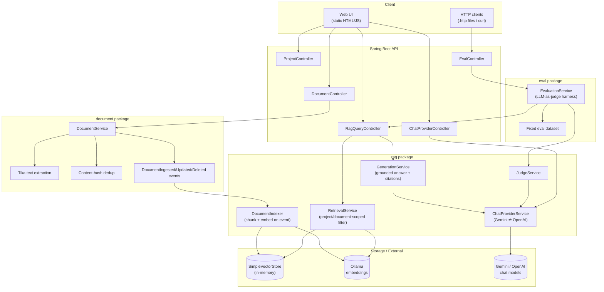
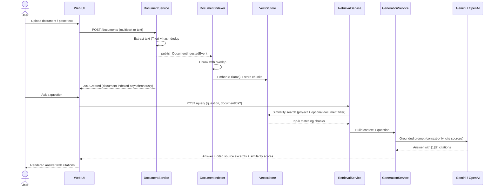

# DevAssist — RAG Capstone

**Ask questions about your own documents and get grounded, cited answers.**

DevAssist is a Spring Boot Retrieval-Augmented Generation (RAG) service: upload documents in almost any format, index them into a vector store, ask natural-language questions scoped to a project, and get an answer that cites exactly which chunk of which document it came from — with a built-in LLM-as-judge harness to continuously score answer quality.

<p align="left">
  
  
  
  
  
</p>

---

## Table of Contents

- [Features](#features)
- [Tech Stack](#tech-stack)
- [Architecture](#architecture)
- [How It Works (Workflow)](#how-it-works-workflow)
- [Use Cases](#use-cases)
- [Screenshots](#screenshots)
- [REST API](#rest-api)
- [Testing](#testing)
- [Evaluation Harness](#evaluation-harness)
- [Getting Started](#getting-started)
- [Configuration](#configuration)
- [Docker Deployment](#docker-deployment)
- [Project Structure](#project-structure)

---

## Features

| Area | Capability |
|---|---|
| **Ingestion** | Upload `.txt`, `.md`, `.pdf`, `.doc/.docx`, `.xls/.xlsx`, `.ppt/.pptx`, `.html`, or paste raw text — extracted via Apache Tika |
| **Dedup** | SHA-256 content-hash dedup on ingest and update — re-uploading identical content is a no-op |
| **Document CRUD** | View, rename, replace content, and delete documents — from the API or the built-in web UI (3-dot menu with confirmation dialogs) |
| **Chunking & Indexing** | Automatic chunking with overlap, embedded via Ollama, stored in an in-memory vector store, with async per-document index-status tracking |
| **Scoped Retrieval** | Ask questions scoped to one project's documents — or a specific subset of documents within a project |
| **Grounded Generation** | Answers are generated **only** from retrieved context, with inline citation markers (`[1]`, `[2]`, …) and the exact source excerpt shown alongside |
| **Refusal on insufficient context** | If nothing relevant is retrieved, the system explicitly declines rather than guessing |
| **Runtime provider switching** | Flip between **Gemini** and **OpenAI** for chat generation at runtime — no restart, no redeploy |
| **Summarization** | One-click summary of any indexed document |
| **LLM-as-judge Evaluation** | A fixed question/answer dataset is scored automatically for faithfulness, completeness, and correct-refusal rate |
| **Observability** | Micrometer/Actuator metrics for retrieval, generation, and summarization latency + token usage, tagged by provider |
| **Consistent error contract** | Every module returns the same structured JSON error shape, with root-cause messages surfaced (not swallowed) |
| **Containerized deployment** | Single `docker compose up` brings up the app + Ollama + embedding model, fully wired |

## Tech Stack

| Layer | Technology |
|---|---|
| Language / Runtime | Java 17 |
| Framework | Spring Boot 4.1.1 |
| AI orchestration | Spring AI 2.0.1 (`ChatClient`, `EmbeddingModel`, `VectorStore` abstractions) |
| Embeddings | Ollama (`nomic-embed-text`) |
| Generation (chat) | Google Gemini (`gemini-3.6-flash`) **and** OpenAI (`gpt-4o-mini`) — switchable at runtime |
| Vector store | Spring AI `SimpleVectorStore` (in-memory) |
| Document parsing | Apache Tika (`tika-core`, `tika-parsers-standard-package`) |
| Validation | Jakarta Bean Validation (`spring-boot-starter-validation`) |
| Observability | Micrometer + Spring Boot Actuator |
| Web layer | Spring Web MVC (`spring-boot-starter-webmvc`) |
| Frontend | Plain HTML/CSS/JS manual-test UI — no framework, no build step |
| Build | Maven, via the Maven Wrapper (`./mvnw`) only |
| Testing | JUnit 5, `@WebMvcTest`, `@SpringBootTest`, plain unit tests |
| Deployment | Docker + Docker Compose |

> Both Gemini and OpenAI are integrated purely through Spring AI's provider-agnostic abstractions — swapping, adding, or removing a provider never touches business logic, only `ChatProviderService`.

## Architecture



**Design decisions worth noting:**
- **Event-driven indexing** — `DocumentService` never talks to the vector store directly; it publishes `DocumentIngestedEvent` / `DocumentUpdatedEvent` / `DocumentDeletedEvent`, and only `DocumentIndexer` reacts to them. Adding document-scoped retrieval or rename support required **zero changes** to indexing code.
- **One-way package dependency**: `eval` → `rag` → `document`/`project` → `common`. Nothing depends on `eval`, so the evaluation harness can be removed or replaced without touching the app it evaluates.
- **Provider-agnostic AI access** — no vendor SDK is called directly; everything goes through Spring AI's `ChatClient`/`EmbeddingModel`/`VectorStore`, so `SimpleVectorStore` → `PgVectorStore` or Gemini → any other model is a configuration change, not a rewrite.

## How It Works (Workflow)



## Use Cases

- **Internal knowledge base Q&A** — upload policy docs, engineering practices, or handbooks and let people ask questions in plain English instead of searching files.
- **Document-scoped research** — narrow a question to a specific subset of uploaded documents instead of an entire project's corpus.
- **Trustworthy answers with receipts** — every answer names the exact chunk it came from, so a reader can verify it instantly instead of taking the model's word for it.
- **Safe "I don't know"** — when nothing relevant is indexed, the system says so instead of hallucinating, which the evaluation harness explicitly scores.
- **Provider cost/availability failover** — hit a rate limit or outage on one LLM provider mid-project? Flip `chat-provider` to the other one and keep working, no redeploy.
- **Continuous answer-quality regression testing** — run the eval harness after any RAG pipeline change to catch a faithfulness or completeness regression before it reaches users.

## REST API

| Method | Path | Purpose |
|---|---|---|
| `POST` | `/api/projects` | Create a project |
| `GET` | `/api/projects` | List projects |
| `GET` | `/api/projects/{id}` | Get a project |
| `PUT` | `/api/projects/{id}` | Update a project |
| `POST` | `/api/projects/{projectId}/documents` | Upload a document file (multipart) |
| `POST` | `/api/projects/{projectId}/documents/text` | Ingest a document from raw text |
| `GET` | `/api/projects/{projectId}/documents` | List documents in a project |
| `GET` | `/api/projects/{projectId}/documents/{documentId}` | Get a document |
| `PUT` | `/api/projects/{projectId}/documents/{documentId}` | Replace a document's content (file) |
| `PUT` | `/api/projects/{projectId}/documents/{documentId}/text` | Replace a document's content (text) |
| `PUT` | `/api/projects/{projectId}/documents/{documentId}/title` | Rename a document |
| `DELETE` | `/api/projects/{projectId}/documents/{documentId}` | Delete a document |
| `GET` | `/api/projects/{projectId}/documents/{documentId}/index-status` | Check vector-indexing status |
| `POST` | `/api/projects/{projectId}/documents/{documentId}/summarize` | Summarize a document |
| `POST` | `/api/projects/{projectId}/query` | Ask a grounded, cited question (optionally scoped to specific `documentIds`) |
| `GET` | `/api/settings/chat-provider` | Get the active chat provider |
| `PUT` | `/api/settings/chat-provider` | Switch the active chat provider (`GEMINI` / `OPENAI`) |
| `POST` | `/api/eval/run` | Run the LLM-as-judge evaluation suite |

Ready-to-run request collections live under [`http/`](http/) — open any `.http` file in an HTTP-client-capable IDE (IntelliJ, VS Code REST Client) or copy the requests into `curl`.

## Testing

- **38** test classes, **257** `@Test` methods
- `@WebMvcTest` for controller/web-layer slices (7 classes), `@SpringBootTest` for true integration/context tests (7 classes), plain JUnit 5 for services and pure logic
- The suite runs under a `test` Spring profile with no real Gemini/OpenAI/Ollama network calls required
- Representative scenarios covered by the suite:
  - Content-hash dedup returns the existing document instead of creating a duplicate
  - Uploading an unsupported file type is rejected with a clear validation error
  - A query with zero retrieved chunks refuses to answer instead of calling the model
  - Document-scoped retrieval only returns chunks from the requested `documentIds`
  - Renaming/deleting a document does not require re-implementing indexing logic (event-driven design)
  - A malformed request produces the same structured error shape across every module
  - A provider-side failure (e.g. quota exceeded) surfaces as a `503` with the real root-cause message, not a generic error
  - Markdown rendering in the UI safely escapes/allowlists link schemes (XSS-hardened)

Run the full suite:

```bash
./mvnw test
```

## Evaluation Harness

`POST /api/eval/run` scores the RAG pipeline end-to-end against a **fixed** 8-question dataset (6 answerable, 2 deliberately unanswerable) seeded into a dedicated evaluation project — it does not evaluate arbitrary user-uploaded documents.

For each question, an **LLM-as-judge** (`JudgeService`, using whichever chat provider is currently active) scores the RAG-generated answer against the retrieved context:

| Metric | Meaning |
|---|---|
| **Faithfulness** (1–5) | Does the answer stick strictly to the retrieved context, with no hallucinated claims? |
| **Completeness** (1–5) | Does the answer cover what the context actually supports? |
| **Correctly-declined rate** | For the intentionally unanswerable questions, did the system correctly refuse instead of guessing? |

Configurable pass/fail gates (`application.properties`):

```properties
devassist.eval.min-faithfulness=4.0
devassist.eval.min-completeness=4.0
devassist.eval.min-correctly-declined-rate=1.0
```

A run returns `passed: true/false` plus the full per-question breakdown, so it can be wired into CI as a regression gate on answer quality.

## Getting Started

**Prerequisites:** Java 17, [Ollama](https://ollama.com) running locally, and an API key for at least one chat provider (Gemini and/or OpenAI).

```bash
# 1. Pull the embedding model Ollama needs
ollama pull nomic-embed-text

# 2. Set at least one chat provider key
export GEMINI_API_KEY=your-key-here
# and/or
export OPENAI_API_KEY=your-key-here

# 3. Run the app (Maven Wrapper only — no global Maven required)
./mvnw spring-boot:run
```

Then open **http://localhost:8080** for the manual-test UI, or drive it via the `.http` files in [`http/`](http/).

## Configuration

Key `application.properties` values (all overridable via environment variables):

| Property | Default | Purpose |
|---|---|---|
| `spring.ai.ollama.embedding.options.model` | `nomic-embed-text` | Embedding model |
| `spring.ai.google.genai.api-key` | `${GEMINI_API_KEY}` | Gemini API key |
| `spring.ai.google.genai.chat.model` | `gemini-3.6-flash` | Gemini chat model |
| `spring.ai.openai.api-key` | `${OPENAI_API_KEY}` | OpenAI API key |
| `management.endpoints.web.exposure.include` | `metrics,health` | Exposed Actuator endpoints |
| `devassist.eval.min-faithfulness` | `4.0` | Eval pass threshold |
| `devassist.eval.min-completeness` | `4.0` | Eval pass threshold |
| `devassist.eval.min-correctly-declined-rate` | `1.0` | Eval pass threshold |

Switch the active chat provider at runtime without touching config:

```bash
curl -X PUT http://localhost:8080/api/settings/chat-provider \
  -H "Content-Type: application/json" \
  -d '{"provider": "OPENAI"}'
```

## Docker Deployment

```bash
docker compose up
```

This brings up three services, fully wired:

| Service | Role |
|---|---|
| `ollama` | Runs the embedding model server, persists model data in a named volume |
| `ollama-pull` | One-shot init container that pulls `nomic-embed-text` into `ollama` before the app starts (retries on transient failure) |
| `app` | Builds from the repo's multi-stage `Dockerfile` (`eclipse-temurin:17-jdk-jammy` build → `eclipse-temurin:17-jre-jammy` runtime), exposes port `8080`, and waits for `ollama-pull` to complete successfully before starting |

Pass `GEMINI_API_KEY` / `OPENAI_API_KEY` via a `.env` file or your shell environment — never commit them.

## Project Structure

```
DevAssist/
├── src/main/java/com/devassist/
│   ├── project/    # Project CRUD
│   ├── document/   # Upload, Tika extraction, dedup, rename/delete, lifecycle events
│   ├── rag/        # Chunking, indexing, retrieval, generation, provider switching, summarization
│   ├── eval/       # LLM-as-judge evaluation harness + fixed dataset
│   └── common/     # Shared error-response contract used by every module
├── src/main/resources/
│   ├── application.properties
│   ├── eval/eval-dataset.json
│   └── static/index.html   # Manual-test web UI (no build step)
├── src/test/java/com/devassist/...  # Mirrors main package structure
├── http/                    # Ready-to-run .http request collections
├── docs/superpowers/plans/  # Dated implementation plans for each feature
├── specs/                   # Feature specs each plan implements
├── docker-compose.yml
├── Dockerfile
└── pom.xml
```

Package dependencies flow one way only: `eval → rag → document/project → common` — nothing depends on `eval`, and `common` depends on nothing. This keeps the evaluation harness fully removable and keeps core RAG logic ignorant of how it's being tested.
